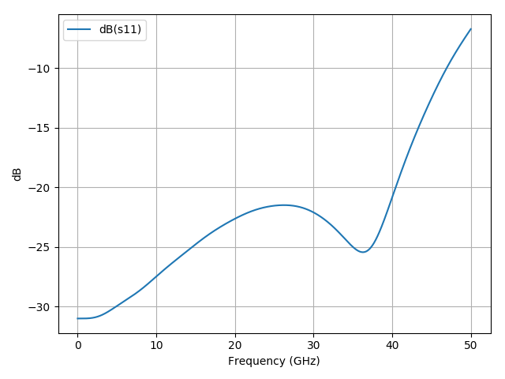

# Examples

## Vertical 2.92 mm connector (vert_connector_ms_oshpark.py)

Hirose HK-R-SR2-1 2.92 mm connector, footprint is compatible with
HRM(G)-300-468B-1 (SMA) and Rosenberger 03K721-40MS3 (3.5
mm). Transition to microstrip on opposite side of an OSHPark 4 layer
PCB. The [Kicad footprint file](vert_connector_ms_oshpark.kicad_mod) is
manually edited to add mask clearance, copper clearance and mounting
holes.

### Response


## Capacitor Ground Cutout (capacitor_ground_cutout.py)

### Usage
```
$ ./capacitor_ground_cutout.py 0201 view_solve
```

'0201' may be substituted for '0402' and refers to the inch capacitor size.

'view_solve' may be reduced to just 'view' or 'solve' to only view or only solve.